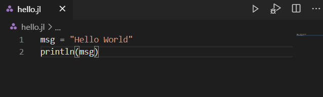
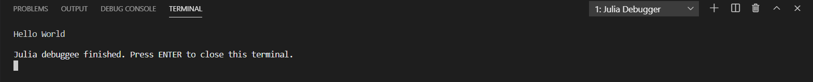

# Getting Started

This guide is intended for new or beginner-level users who are new to the Visual Studio Code extension. The getting started tasks use the Julia programming language to create a “Hello World” program in VS Code.

## Prerequisites

- Julia
- VS Code
- VS Code Julia extension

## Installation and Configuration

### Installing Julia

Download the latest stable version of Julia, based on the platform you are using, from the [Julia](https://julialang.org/downloads/) homepage.

### Installing VS Code

Download and install VS Code, based on the platform you are using, from the [VS Code](https://code.visualstudio.com/) homepage.

### Installing the Julia extension

- Start or open Visual Studio Code.
- Select **View** and then click **Extensions** to open Extension View.
- Enter the term `julia` in the marketplace search box. Click the green **Install** button to download the extension.


You successfully downloaded the Julia extension for VS Code.

_NOTE: It is recommended that you restart VS Code after installation._

### Configuring the Julia extension

If you installed Julia into a standard location on Mac or Windows, or if the Julia binary is on your `PATH`, the Julia VS Code extension automatically finds your Julia installation. You do not need to configure the extension. Continue onto the next section.

If the VS Code extension does not find your Julia installation automatically, or you want to use a different Julia installation than the default one, use the following steps to configure the extension.

  1. Set the `julia.executablePath` to the full path of Julia executable that the extension should use.
  2. To edit your configuration settings, select menu **Code** (on Mac) or **File** (otherwise), then select **Preferences**, and then click **Settings**.
  3. Ensure that your user settings include the `julia.executablePath` setting.

_NOTE: The format of the string should follow your platform specific conventions.  Note that the backslash `\` is the escape character in JSON, therefore use `\\` as the path separator character on Windows._

## Creating Your First Julia Hello World program

1. From the File Explorer toolbar, click the **New File** button on the `Hello` folder:


2. Name the file `hello.jl`, and it automatically opens in the editor.


The .jl file extension indicates to VS Code that you interpret this file as a Julia program, therefore it evaluates the contents with the Julia extension and the selected interpreter.

3. Enter the following source code in hello.jl:

```julia
msg = "Hello World"
println(msg)
```

## Running Hello World program

To run the Hello World program, click **Run: Julia File** in Terminal play button in the top-right side of the editor.



You can see the corresponding output in the terminal.



Congratulations! You have just completed your first Julia program.
