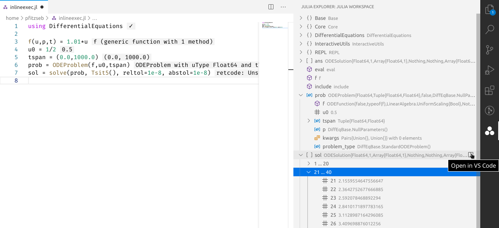

# Julia VS Code extension v0.16 release

Welcome to the v0.16 release of the Julia VS Code extension.

## Inline evaluation

Code evaluation has been overhauled for this release.

The `Julia: Execute *` (e.g. `Julia: Execute Code And Move`, by default accesible with `Alt-Enter`) commands now asynchronously evaluate the selection, current code block, or file. These commands also evaluate the code in the context of their containing module, which is indicated in the status bar:

Evaluating code directly into a module is especially helpful for a Revise-less workflow -- it allows you to easily update methods or globals.

Another new feature in this release are inline results for code evaluated from the editor. To enable them, select the `inline` result type in the extension's `Julia > Execution: Result Type` setting.

Inline results display the first line of the result's plain-text representation (via `Base.show`). Details are available by hovering over the result, like in the screenshot below (make sure you have the `Editor > Hover: Enabled` setting ticked):

We're still working on inline evaluation, inline results, and related features, so expect more changes in the following releases.

!!! note

    The `Julia: Send Current Line or Selection to REPL` command simply copies the current line or selection and pastes it into the REPL, so it does not take the code's module into account.

## Workspace view
It's now possible to inspect the current REPL's runtime state in the Workspace pane, which you can open with the `View: Show Julia Explorer` command or by clicking on the Julia symbol in the toolbar.

You can drill down into modules and find out what they define, inspect complex `struct`s or dictionaries, and even inspect arbitrarily large arrays:

All of this lazy-loaded, so don't worry about recursive types or big arrays -- we're taking great care not to influence the editor's performance or mess with Julia's GC.

Supported types like arrays (or other table-like objects) and plots can be shown in the integrated table viewer or plot pane with the click of a button.

## Faster REPL startup

[TODO]
