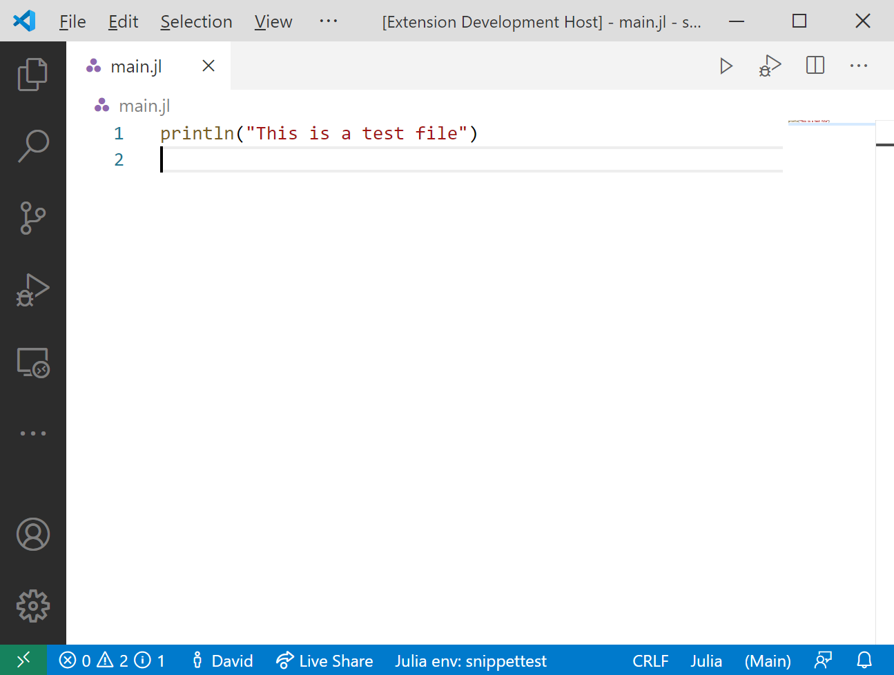

# Julia VS Code extension v0.17 release

Welcome to the v0.17 release of the Julia VS Code extension.

## Global variable support in the debugger variable explorer

[TODO SP]

## Debug and run buttons above Julia files

We added a run and debug button above the file editor area when you open a Julia file that makes it easier to run the currently active file:



## Support for step in targets in the debugger

[TODO SP]

## Profile viewing support

We added new functionality that allows you to save profiling results in a `*.cpuprofile` file. Recent versions of VS Code have built-in support to analyze and visualize these profiling result files.

The easiest way to use this functionality is the `@profview` macro, which executes your code under the Julia profiler and then saves the results as a `*.cpuprofile` file. To use it, start a Julia REPL, and then call `@profview` like this:

```julia
julia> @profview my_function_that_should_be_profiled()
```

Alternatively you can call the function `view_profile` in the REPL which will save the profiling results from the previous profiling session.

Once you have created a `*.cpuprofile` file with one of these methods, you can open it in VS Code. The initial view shown is a tabular display of the profiling results. The search bar at the top allows you to filter the profiling results and provides a rich [query language](https://github.com/microsoft/vscode-js-profile-visualizer/blob/master/query-language.md) for more advanced queries:


You can also look at the same information in a flamegraph by clicking the little fire button next to the search area. The first time you do so, you will be asked to install another extension, go ahead and do that. The flamegraph visualization then looks like this:


Special thanks to [Valentin](https://github.com/vchuravy) and [Connor](https://github.com/connor4312) for their help with this feature!

## Stackframe highlighting for inline evaluations

Now our inline execution will highlight all lines in backtrace when you hit an error:


If you hover your mouse over any of the lines, the detail of the error will show up and you can goto whichever frame in a backtrace by clicking the links:


Additionally, the topmost buttons allow you to go to first/previous/next/last frames, and clear all the traces:


We also added the improvement to cut off the julia-vscode extension's internal lines from backtrace so that they won't appear in users' stackframe.

## Configuration option to exclude folders from linting

We've added an new configuration option `julia.lint.disabledDirs`.
It specifies sub-directories in [a package directory](https://docs.julialang.org/en/v1/manual/code-loading/#Package-directories-1) where only basic linting is enabled,
and this will drastically lowers the chance for false positives.
By default, `test` and `docs` are set, so most problematic errors (e.g. "Missing reference ...") will be suppressed there.

Note this config is only a temporary fix for our environment handling --
we will work on redesigning the whole environment handling, which will hopefully get rid of most of those false positives,
and then we may probably remove this configuration in the future.

## Add an extension API

[TODO SP]

## Bugfixes

We've also fixed a plethora of issues across the entire extension.
