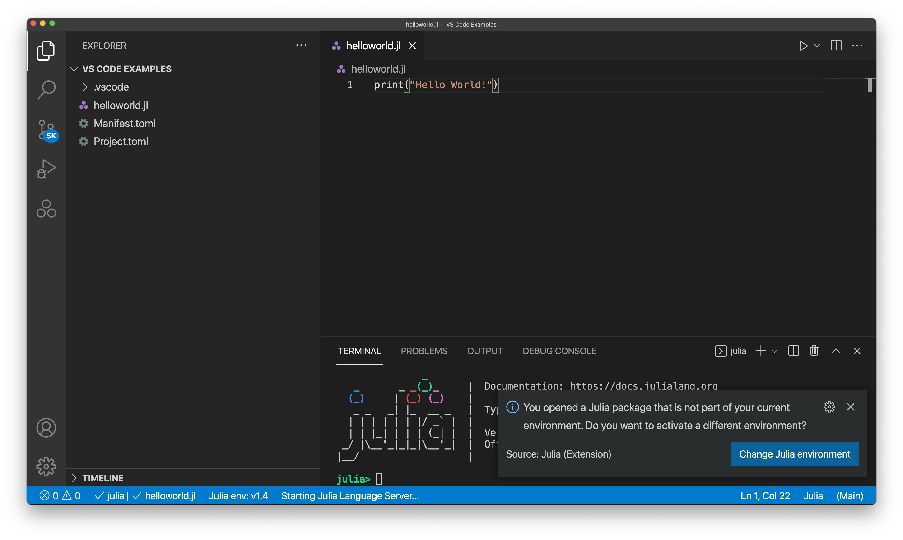

# Julia Environments

The Julia VSCode Extension provides support for managing and switching your current Julia environment. You can click the "Julia env" button as shown below to select which environment you want to use:

If your active directory (shown on the left side of VSCode) contains a Julia environment and you try to switch to an alternate environment, you will be prompted with the message shown below:

