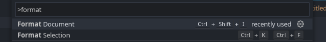

# Formatting Code
Code formatting is powered by [JuliaFormatter.jl](https://github.com/domluna/JuliaFormatter.jl). Both the `Format Document` command (`Ctrl-Shift-I`) and `Format Selection` (`Ctrl-K Ctrl-F`) are supported.

The default formatting is fairly conservative and unintrusive, but you can customise it with a `JuliaFormat.toml` file in your project:

```toml
style = "blue"

[options]
margin = 92
```

`style` picks one of the presets — `default`, `yas`, `blue`, `sciml`, `minimal` (the default) or `runic` — and `[options]` adjusts individual settings on top of it, accepting any [JuliaFormatter.jl option](https://domluna.github.io/JuliaFormatter.jl/stable/). You can also keep folders out of formatting altogether with `exclude`, or format part of the project differently. See [Configuration Files](configuration.md) for all of that.

**Note:** the extension does not read JuliaFormatter.jl's own `.JuliaFormatter.toml`. If you have one, copy its settings into `JuliaFormat.toml`, putting the individual options under `[options]`.

Formatting helps to keep code readable by automatically aligning indentations and spaces.

The Julia formatter can automatically make this code:
```julia
f(x)=2x+3
print(f'( 2 ))

open("myfile.txt", "w") do io
	write(io, "Hello world!")
    end;
```

look like this:
```julia
f(x) = 2x + 3
print(f'(2))

open("myfile.txt", "w") do io
    write(io, "Hello world!")
end;
```

It's the very same code, though now it's much easier to read.

In order to format your code press `shift + cmd|windows + p` to bring up the command palette and search for `Format Document`


