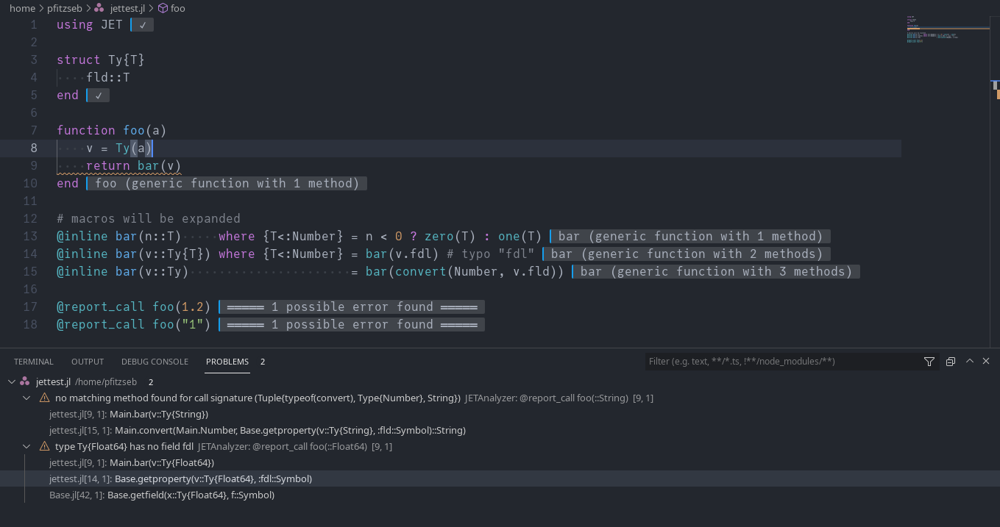

# Linting and Diagnostics

All Julia code in the workspace is statically linted, and the problems that are found show up in the Problems panel and inline in the editor.

## Configuring the linter

Linting is configured with a `JuliaLint.toml` file in your project, rather than through VS Code settings. Each kind of problem is a *rule* with a *severity*, and the file changes those severities:

```toml
[rules]
# Stop reporting this one at all.
unused_binding = "off"

# Treat this one as an error, which also fails `julialint` in CI.
nothing_comparison = "error"
```

To find out what a rule is called, look at the **Code** column next to the problem in the Problems panel — that is the name you write under `[rules]`.

To turn most of the linter off while keeping the checks that catch genuine breakage, use a preset:

```toml
preset = "minimal"
```

You can also keep whole folders out of linting entirely:

```toml
exclude = ["gen/**", "deps/**"]
```

Because the settings live in a file in the project, they are shared with everyone who works on it and with the `julialint` command line tool in CI. See [Configuration Files](configuration.md) for the full picture, including how the file is discovered and how to apply different rules to different folders.

## Runtime diagnostics
Packages like [JET.jl](https://github.com/aviatesk/JET.jl) can analyze code at runtime (for some definition of "runtime"):


You can opt out of this feature with the `julia.showRuntimeDiagnostics` setting. Use `Julia: Clear Runtime Diagnostics` or `Julia: Clear Runtime Diagnostics by Provider` to clear the displayed diagnostics.

Package authors who want to use this feature can simply implement a type that supports the `application/vnd.julia-vscode.diagnostics` MIME type. Check `VSCodeServer.DIAGNOSTIC_MIME` in a the integrated Julia REPL for more information on the API.
