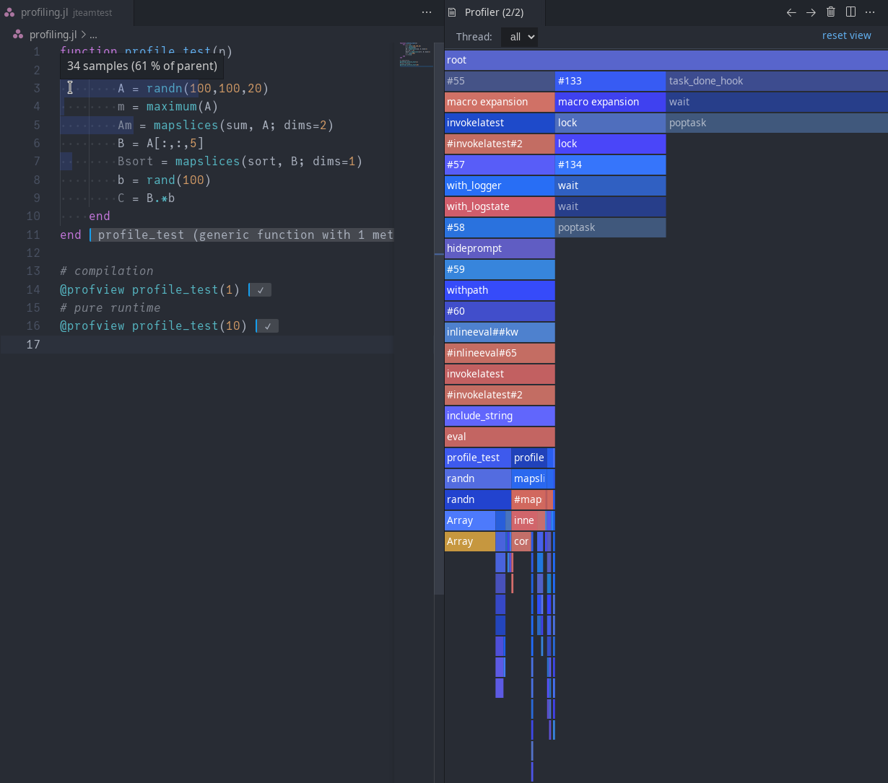

# Profiling code

Julia comes with it's own [sampling profiler](https://docs.julialang.org/en/v1/stdlib/Profile/) and there are [various packages](https://github.com/timholy/FlameGraphs.jl) to visualize these profile traces.

The VS Code extension comes with it's own profile viewer. Profiling the example function from the [ProfileView.jl readme](https://github.com/timholy/ProfileView.jl)
```julia
function profile_test(n)
    for i = 1:n
        A = randn(100,100,20)
        m = maximum(A)
        Am = mapslices(sum, A; dims=2)
        B = A[:,:,5]
        Bsort = mapslices(sort, B; dims=1)
        b = rand(100)
        C = B.*b
    end
end

# compilation
@profview profile_test(1)
# pure runtime
@profview profile_test(10)
# viewing allocations
@profview_allocs profile_test(100)
```
shows a flame graph and inline annotations:


Clicking on any element in the flamegraph zooms in on that element; double clicking on the background (or using the "reset view" button in the upper right) will restore the initial view. Ctrl-Click to open the referenced file.

The tooltip will tell you the number of samples collect in a certain frame as well as the percentage of the top-most displayed frame. There are some heuristics for special flags like garbage collection, dynamic dispatch, and more (these are also color coded).


The inline view shows you how much of the parent frame's samples originate on which line (and also the flags, as above, when hovering over the start of the inline annotation):


