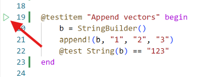

# Test item framework

The test item framework is a set of packages and UI features that make it easy to write and run tests for Julia packages.

The main benefit of this framework is that test code can be structured into test items that can then easily be run
individually.

## Writing test items

The core feature of the test item framework is that you can structure tests into `@testitem` blocks and then individually run those, rather than having to run all your tests at once. A typical `@testitem` might look like this:

```julia
@testitem "First tests" begin
    x = foo("bar")

    @test length(x)==3
    @test x == "bar"
end
```

A `@testitem` always has a name (here "First tests") and then some code in a `begin ... end` block. The code inside a `@testitem` must be executable by itself, i.e. it can not depend on code that appears outside of the `@testitem`, unless that code is somehow explicitly imported or included from within the `@testitem`. There is one exception to this: the code inside the `@testitem` will run inside a temporary module where `using Test` and `using MYPACKAGENAME` was already executed, so anything exported from either the `Test` module or the package your are developing can be directly used. In the example above this applies to the `foo` function (presumably defined in the package that is being tested) and the `@test` macro.

`@testitem`s can appear anywhere in a package. They do not have to be in the `test` folder, nor do they have to be in a file that is included by `test/runtests.jl`. In fact, `@testitem`s can even be located inside your regular package code, for example next to the code they are testing. In that case you just need to take a dependency on the [TestItems.jl](https://github.com/julia-vscode/TestItems.jl) package so that you have access to the `@testitem` macro. If you have a package `MyPackage`, then the file `src/MyPackage.jl` could look like this:

```julia
module MyPackage

using TestItems

export foo

foo(x) = x

@testitem "First tests" begin
    x = foo("bar")

    @test length(x)==3
    @test x == "bar"
end

end
```

If you don’t like this inline `@testitem` style, you can also just put `@testitem` blocks into Julia files in your test folder.

## Running test items inside VS Code

When you open a Julia package inside VS Code and have the [Julia extension](https://www.julia-vscode.org/) installed it will constantly (after every keypress!) look for any and all `@testitem`s in your Julia files. If any are found, they will appear in various places in the UI.

You can find all detected `@testitem`s in the Testing activity bar in VS Code:


The testing activity area then provides you with options to run individual `@testitem`s, look at results etc.

VS Code will also place a small little run button next to each detected `@testitem` in the text editor itself:



In addition to all these UI elements that allow you to run tests, there is also UI to display test results. For example, when you run tests and some of them fail, the extension will collect all these test failures and then display them in a structured way, directly at the place in the code where a specific test failed:


Especially when you run a lot of tests with large test files this makes it much easier to find the specific test that failed, no more hunting in the REPL for file and line information!

## Running tests from the command line

You can use the [TestItemRunner.jl](https://github.com/julia-vscode/TestItemRunner.jl) package to run `@testitem`s as part of a traditional `Pkg.test` workflow.

To enable integration with `Pkg.test` for a package that uses `@testitem`, you just have to do two things:

1) Add [TestItemRunner.jl](https://github.com/julia-vscode/TestItemRunner.jl) as a test dependency to your package
2) Put the following code into the package’s `test/runtests.jl` file:

```julia
using TestItemRunner

@run_package_tests
```

## Tags

You can now add tags to `@testitem`s. Tags can be used both in the VS Code UI and via [TestItemRunner.jl](https://github.com/julia-vscode/TestItemRunner.jl) to filter which test items you want to run.

The syntax for adding tags is this:

```julia
@testitem "My testitem" tags=[:skipci, :important] begin
    x = foo("bar")

    @test length(x)==3
    @test x == "bar"
end
```

You can then filter the test list in the VS Code UI with these same tags:


And you can also use tags in `test/runtests.jl` to filter down the list of tests that will run via the traditional `Pkg.test` entry point:

```
using TestItemRunner

@run_package_tests filter=ti->!(:skipci in ti.tags)
```

The [filter](#Filtering-support-in-TestItemRunner.jl) section below has a more complete description of the new filter keyword for the `@run_package_tests` macro.

## Parallel test execution in VS Code

The VS Code extension has a setting that controls how many Julia processes you want to use for parallel test execution:


The default value is `1`, so you have to change that to use the parallel test execution feature. A value of `0` will use as many test processes as you have processors.

Once you configured more than one test process, individual `@testitem`s will run in parallel.

There is a trade-off here: more test processes mean more memory is needed, and there is also potentially additional overhead to get all processes to spin up and be ready to actually run `@testitem`s.

## Managing test processes

Test processes that are launched via this new test UI in VS Code are not automatically terminated, i.e. they hang around and take up memory and other resources. That of course has many benefits, namely that `@testitem`s can be executed very quickly once the test process is up and running, but in some situations one might still want to simply terminate all currently running test processes.

To enable this, all test processes show up in the Julia Workspace, alongside any REPL or Notebook processes that might also be running. And you can terminate Julia test processes via this UI by clicking on the `Stop Test Process` button. In this screenshot there are four test processes running:

## Filtering support in TestItemRunner.jl

You can pass a generic filter function to the `@run_package_tests` macro to select which `@testitem`s you want to execute. The section above used tags to select which tests to run, but you can also filter based on the filename where a `@testitem` is defined or the name of the `@testitem`.

The way this works is that you can pass a filter function to the `@run_package_tests` macro. This filter function will be called once for each `@testitem` that is detected in your project, and the function must either return `true` if this test item should be run or `false` to not run it. `@run_package_tests` will pass a named tuple with three fields to your filter function that contains meta information about the specific test item, namely the field `filename` (the full path of the file where the `@testitem` is defined), `name` (the name of the `@testitem` that you defined) and `tags` (a vector of `Symbol`s). With this information you can write arbitrarily complex filter conditions. For example, here I’m filtering out any `@testitem` that has the `:skipci` tag and I’m also only running tests that are defined in one specific file:

```julia
@run_package_tests filter=ti->( !(:skipci in ti.tags) && endswith(ti.filename, "test_foo.jl") )
```

## Option for default imports

When you write a `@testitem`, by default the package being tested and the `Test` package are imported via an invisible using statement. In some cases this might not be desirable, so one can control this behavior on a per `@testitem` level via the `default_imports` option, which accepts a `Bool` value. To disable these default imports you, you would write:

```julia
@testitem "Another test for foo" default_imports=false begin
    using MyPackage, Test

    x = foo("bar")

    @test x != "bar"
end
```

Note how we now need to add the line `using MyPackage, Test` manually to our `@testitem` so that we have access to the `foo` function and `@test` macro.

## Sharing code across `@testitem`s

By default `@testitem`s do not share any code between each other and have no dependencies between each other. These properties make it feasible to run `@testitem`s by themselves, but sometimes one wants to share common code between multiple `@testitem`s. The test item framework provides two macros for this purpse: `@testsnippet` and `@testmodule`. These two macros can appear in any `.jl` file in a package.

### Test snippets

A `@testsnippet` is a block of code that individual `@testitem`s can run before their own code runs. If a `@testitem` takes a dependency on a particular `@testsnippet`, that snippet will run every time the `@testitem` runs.

The definition of a `@testsnippet` might look like this

```julia
@testsnippet MySnippet begin
    foo = "Hello world"
end
```

A `@testitem` can utilize this snippet by using the `setup` keyword like this:

```julia
@testitem "My test item" setup=[MySnippet] begin
    @test foo == "Hello world"
end
```

### Test modules

A `@testmodule` defines a Julia module that can be accessed from `@testitem`s. Such a module will only be run _once_ per Julia test process. If for example two `@testitem`s depend on a `@testmodule`, it will only be evaluated once, and then the entire module will be made available to both `@testitem`s.

The definition of a `@testmodule` might look like this

```julia
@testmodule MyModule begin
    foo = "Hello world"
end
```

A `@testitem` can utilize this module by again using the `setup` keyword. Unlike with `@testsnippet`s, the content of a `@testmodule` is run inside a regular Julia `module`, so to access content inside there one needs to prefix the module name to any name defined in the test module. A `@testitem` that utilizes the `@testmodule` just defined might look like this:

```julia
@testitem "My test item" setup=[MyModule] begin
    @test MyModule.foo == "Hello world"
end
```

Note how we access `foo` with the expression `MyModule.foo` here.

## Debugging of `@testitem`s

`@testitem`s can be run in the debugger by launching them via the `Debug Test` command. This command can be access in various places in the VS Code UI. In the test main testing view it is available here:


One can also right click on the run test icon in the text editor to select the debug option:


When a test item is run in the debugger, one can set breakpoints both in the code that is being tested or in the `@testitem` itself and then utilize all the regular features of the Julia VS Code debugger.

## Code coverage

On Julia 1.11 and newer one can run test items in a code coverage mode and display code coverage results directly in VS Code.

To run test items in code coverage mode one launches them with the command `Run Tests with Coverage`. This command is availble both in the main testing view


as well as in the context menu in the text editor:


The coverage results are then displayed in various ways in the VS Code UI. For example a summary view shows coverage per file:


One can see detailed line coverage information inside the text editor:


Coverage results are also displayed inline in the regular explorer part of the VS Code UI.
